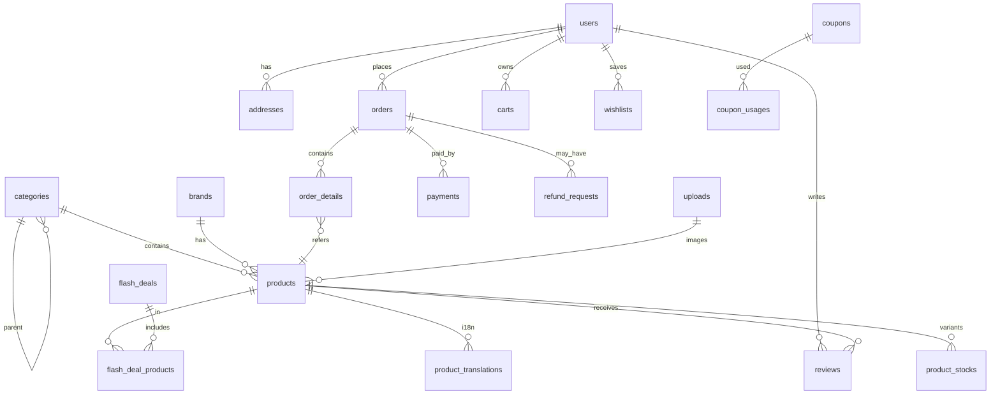

# 04 — Data Schema / Database Design
**DBMS:** MySQL 8 (InnoDB, utf8mb4_unicode_ci) | จัดการผ่าน **Prisma ORM** | ราคาเก็บเป็น `Decimal(20,2)` ในสกุลเงินหลัก (base currency)
ทุกตารางมี `id BigInt @id @default(autoincrement())`, `createdAt`, `updatedAt` (ละไว้ด้านล่าง) — ตารางสำคัญใช้ `deletedAt DateTime?` (Soft delete)

## 1. ER Diagram (ภาพรวม)

## 2. Users & Auth
### `model User` (table: `users`)
| Field (Prisma) | Type | Note |
|---|---|---|
| name | String @db.VarChar(191) | |
| email | String? @unique @db.VarChar(191) | |
| phone | String? @unique @db.VarChar(30) | |
| password | String @db.VarChar(255) | bcrypt (`bcryptjs`) |
| userType | UserType @default(customer) | enum: `admin, staff, customer` |
| avatarUploadId | BigInt? | FK → `Upload` |
| emailVerifiedAt | DateTime? | |
| provider, providerId | String? | social login (NextAuth.js) |
| banned | Boolean @default(false) | |
| sessionToken | String? | ใช้กับ NextAuth session (แทน remember_token) |

### `model Address` (table: `addresses`)
userId FK, name, phone, address, countryId FK, stateId FK, cityId FK, postalCode, isDefault Boolean

### Role / Permission
ใช้ตาราง `roles`, `permissions`, `user_roles`, `role_permissions` (custom RBAC หรือปรับใช้แนวคิดจาก CASL) — โครงสร้างตารางเทียบเท่ากับของ spatie/laravel-permission เดิม

## 3. Catalog
### `model Category` (table: `categories`)
| Field | Type | Note |
|---|---|---|
| parentId | BigInt? | FK → self, ระดับบน = null |
| level | Int @db.TinyInt | 0,1,2 |
| name | String @db.VarChar(191) | ภาษาหลัก |
| slug | String @unique @db.VarChar(191) | |
| iconUploadId | BigInt? | FK → Upload, ไอคอนใน Sidebar |
| bannerUploadId | BigInt? | FK → Upload, รูปใน Featured strip |
| orderLevel | Int | เรียงลำดับ |
| featured | Boolean @default(false) | แสดงใน Featured strip |
| metaTitle, metaDescription | String? | SEO |

### `model CategoryTranslation` (table: `category_translations`)
categoryId FK, lang String @db.VarChar(10), name — `@@unique([categoryId, lang])`

### Brand / BrandTranslation
name, slug @unique, logoUploadId, metaTitle, metaDescription, top Boolean

### Attribute / AttributeValue / Color
- `attributes`: name (Size, Material)
- `attribute_values`: attributeId FK, value
- `colors`: name, code (#hex)

### `model Product` (table: `products`)
| Field | Type | Note |
|---|---|---|
| name | String @db.VarChar(255) | |
| slug | String @unique @db.VarChar(255) | |
| categoryId | BigInt | FK → Category |
| brandId | BigInt? | FK → Brand |
| addedByUserId | BigInt | FK → User |
| thumbnailUploadId | BigInt? | FK → Upload |
| photos | Json | array upload ids |
| videoProvider, videoLink | String? | |
| tags | String @db.VarChar(500) | |
| description | String @db.LongText | |
| unitPrice | Decimal @db.Decimal(20,2) | |
| discount | Decimal @default(0) @db.Decimal(20,2) | |
| discountType | DiscountType | enum: `amount, percent` |
| discountStartDate, discountEndDate | DateTime? | |
| tax, taxType | Decimal / TaxType | |
| colors | Json | color ids |
| attributes | Json | attribute ids |
| choiceOptions | Json | `[{ attributeId, values[] }]` |
| variantProduct | Boolean | |
| currentStock | Int | รวมทุก variant |
| minQty | Int @default(1) | |
| lowStockQuantity | Int | แจ้งเตือน |
| shippingType | ShippingType | enum: `free, flat_rate, zone` |
| shippingCost | Decimal @db.Decimal(20,2) | |
| weight | Decimal @db.Decimal(8,2) | kg |
| published | Boolean | |
| featured | Boolean | |
| **todaysDeal** | Boolean | แสดงในกล่อง Todays Deal |
| cashOnDelivery | Boolean | |
| numOfSale | Int | สำหรับ Best selling |
| rating | Decimal @db.Decimal(3,2) | cache ค่าเฉลี่ย |
| metaTitle, metaDescription, metaImgUploadId | | SEO |
| deletedAt | DateTime? | |
**Index:** `@@index([categoryId, published])`, `@@index([todaysDeal, published])`, `@@index([featured])`, FULLTEXT(name, tags) — เพิ่มผ่าน raw SQL migration (Prisma ยังไม่รองรับ FULLTEXT index โดยตรง ใช้ `@@fulltext` หากใช้ MySQL provider เวอร์ชันที่รองรับ)

### `model ProductTranslation` (table: `product_translations`)
productId FK, lang, name, description, unit — `@@unique([productId, lang])`

### `model ProductStock` (variants, table: `product_stocks`)
productId FK, variant String (เช่น `Red-XL`), sku String @unique @db.VarChar(100), price Decimal, qty Int, imageUploadId FK?

### `model Review` (table: `reviews`)
productId FK, userId FK, orderId FK, rating Int @db.TinyInt (1-5), comment String, photos Json, status ReviewStatus (`pending`, `approved`)

## 4. Shopping
### `model Cart` (table: `carts`)
| Field | Type | Note |
|---|---|---|
| userId | BigInt? | |
| tempUserId | String? @db.VarChar(64) | สำหรับ Guest |
| productId | BigInt | FK |
| variation | String? | |
| price | Decimal | snapshot ตอนเพิ่ม (คำนวณใหม่ตอน checkout) |
| tax | Decimal | |
| shippingCost | Decimal | |
| quantity | Int | |
| addressId | BigInt? | FK |
| couponCode | String? | |
| discount | Decimal | |

### `model Wishlist` (table: `wishlists`)
userId FK, productId FK — `@@unique([userId, productId])`

### `model Compare` (table: `compares`, หรือเก็บใน Redis session)
userId String?, tempUserId String?, productId FK

## 5. Orders & Payments
### `model Order` (table: `orders`)
| Field | Type | Note |
|---|---|---|
| code | String @unique @db.VarChar(30) | เช่น `20260923-000123` |
| userId | BigInt? | |
| guestId | String? | |
| shippingAddress | Json | snapshot |
| billingAddress | Json | |
| shippingType, pickupPointId | | |
| deliveryStatus | DeliveryStatus | enum: `pending, confirmed, picked_up, on_the_way, delivered, cancelled` |
| paymentType | String @db.VarChar(50) | stripe, paypal, omise, cod, bank |
| paymentStatus | PaymentStatus | enum: `unpaid, paid, refunded, partially_refunded` |
| paymentDetails | Json | response จาก gateway |
| subtotal, tax, shippingCost, couponDiscount, grandTotal | Decimal @db.Decimal(20,2) | |
| currencyCode | String @db.VarChar(10) | สกุลที่ลูกค้าเห็น |
| exchangeRate | Decimal @db.Decimal(15,6) | ณ เวลาสั่ง |
| trackingCode | String? | |
| notes | String? | |
| viewed | Boolean | แอดมินเปิดดูแล้ว |
**Index:** `@@index([userId])`, `@@index([deliveryStatus])`, `@@index([paymentStatus])`, `@@index([createdAt])`

### `model OrderDetail` (table: `order_details`)
orderId FK, productId FK, productName String (snapshot), variation, price, tax, shippingCost, quantity, deliveryStatus, paymentStatus

### `model OrderStatusHistory` (table: `order_status_histories`)
orderId FK, status, note, changedByUserId FK

### `model Payment` (table: `payments`)
orderId FK, userId FK, amount Decimal, method, transactionId String @unique, status, payload Json

### `model RefundRequest` (table: `refund_requests`)
orderId FK, orderDetailId FK, userId FK, reason String, refundAmount Decimal, status RefundStatus (`pending, approved, rejected`), adminNote

## 6. Marketing
### `model FlashDeal` (table: `flash_deals`)
title, slug, startDate, endDate (DateTime), status Boolean, featured Boolean, backgroundColor, textColor, bannerUploadId

### `model FlashDealProduct` (table: `flash_deal_products`)
flashDealId FK, productId FK, discount Decimal, discountType DiscountType

### `model Coupon` (table: `coupons`)
type CouponType (`cart_base, product_base`), code String @unique, details Json (minBuy, maxDiscount, productIds), discount Decimal, discountType DiscountType, startDate, endDate, usageLimit Int?, perUserLimit Int

### `model CouponUsage` (table: `coupon_usages`)
couponId FK, userId FK, orderId FK

### `model Subscriber` (table: `subscribers`)
email @unique

## 7. Website / CMS
### `model Slider` (Hero slider, table: `sliders`)
uploadId FK, link String, sortOrder Int, status Boolean, lang String?

### `model Banner` (Promo banners, table: `banners`)
position BannerPosition (`home_1, home_2, home_3, ...`), uploadId FK, link, sortOrder, status

### `model HomeFeaturedCategory` (table: `home_featured_categories`)
categoryId FK, sortOrder — (max 8)

### `model Page` (table: `pages`)
title, slug @unique, content String @db.LongText, type PageType (`custom, system`), metaTitle, metaDescription

### `model BusinessSetting` (key-value, table: `business_settings`)
| Field | Type |
|---|---|
| type | String @unique @db.VarChar(191) (เช่น `header_logo`, `base_color`, `todays_deal_enabled`, `system_default_currency`) |
| value | String @db.LongText |
| lang | String? |
> อ่าน/เขียนผ่าน helper `getSetting()` / `setSetting()` พร้อม cache ชั้น Redis

### `model Upload` (Media library, table: `uploads`)
userId FK, fileOriginalName, fileName (path), extension, type UploadType (`image, video, document, archive`), fileSize Int, width, height

## 8. Localization & Currency
### `model Language` (table: `languages`)
name, code (en, th), flag, rtl Boolean, status

### `model Translation` (table: `translations`)
lang, langKey String @db.VarChar(191), langValue String — `@@index([lang, langKey])`

### `model Currency` (table: `currencies`)
name (U.S. Dollar), symbol ($), code (USD), exchangeRate Decimal @db.Decimal(15,6), status, symbolPosition (`before, after`), decimalPlaces Int (ภาพใช้ 3 → `$52.000`), decimalSeparator, thousandSeparator

## 9. Shipping
`countries` (name, code, status) → `states` → `cities` (cost Decimal) ; `pickup_points` (name, address, phone, staffId, status)

## 10. System
`activity_logs` (custom audit log middleware), `notifications` (เก็บใน DB + ส่งผ่าน Nodemailer/Resend), `contacts` (name, email, phone, message, replied), BullMQ built-in job/failed-job tracking (ผ่าน Redis, ดูใน Bull Board)

## 11. Seed Data (ตรงกับภาพ)
รันผ่าน `prisma db seed` (สคริปต์ `prisma/seed/demoSeeder.ts`)
- Categories: 11 หมวดตาม sidebar
- Featured: Sports & outdoor, Mobile Phones, Women Watches, Women Dress, Baby Dress, Men Formal, Doll, Tools
- Currency: USD ($, before, 3 decimals, `.` decimal / `,` thousand)
- Language: English (default)
- Todays deal: 4+ สินค้าตัวอย่าง
- Sliders: 3, Promo banners: 3

> **หมายเหตุการย้ายระบบ:** ชื่อตาราง (table name) และคอลัมน์ยังคง `snake_case` ใน MySQL เดิมทุกตาราง โดยใช้ Prisma `@map` / `@@map` แปลงเป็น `camelCase` field ฝั่งโค้ด เพื่อให้ schema DB เข้ากันได้กับข้อมูลเดิม (migration path) และโค้ดฝั่ง TypeScript ยังคง convention camelCase ตาม 05-Coding-Style-Rules
